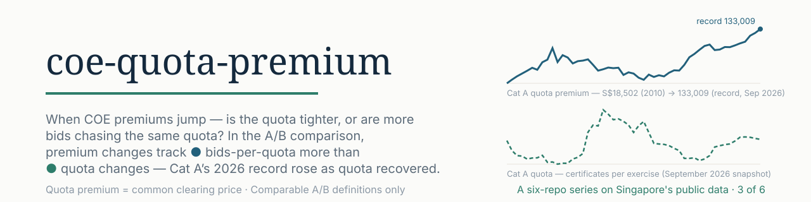
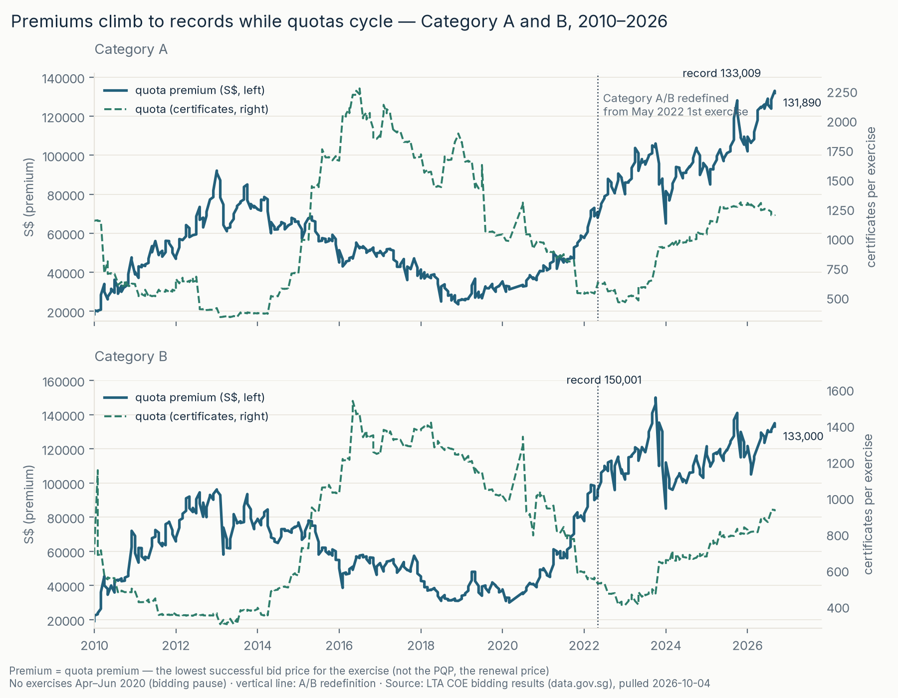
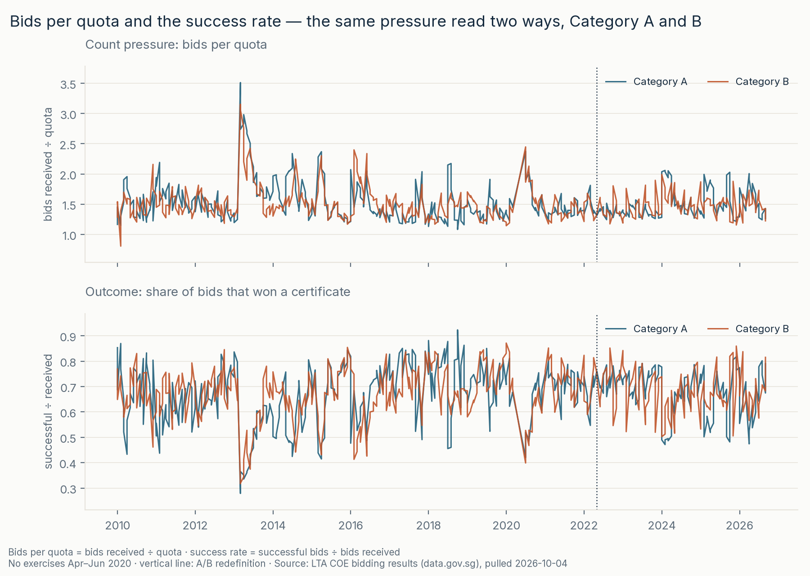
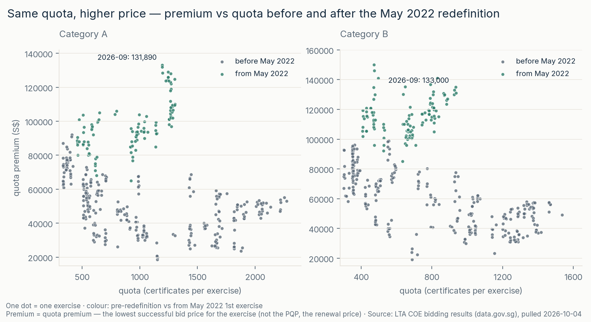

<picture>
  <source media="(prefers-color-scheme: dark)" srcset="assets/banner-dark.svg">
  <source media="(prefers-color-scheme: light)" srcset="assets/banner.svg">
  
</picture>

# coe-quota-premium

[](https://github.com/faizsaifulnizam/coe-quota-premium/actions/workflows/ci.yml) [](LICENSE)   [](https://data.gov.sg/datasets/d_69b3380ad7e51aff3a7dcc84eba52b8a/view) 

> **Answer:** Across 396 auctions since 2010, premium jumps travel with **bid-count pressure, not quota cuts**: exercise-to-exercise premium moves associate with **bids-per-quota** (Spearman ρ **+0.37** Cat A / **+0.56** Cat B since May 2022) more than with **quota** (ρ **−0.14 / −0.09**), and at the 25 largest jumps the quota was as likely to rise as fall (median **0.0%**) while bids-per-quota rose in **19 of 25** — the two biggest jumps of the series, both in **2024-01 R2**, came with flat quotas and bid surges (Cat B **+26,990**, bids per quota 1.34 → 1.99; Cat A **+16,579**, 1.28 → 2.04). The clean supply-side jump: Cat C **+8,010** after a **−43.6%** quota cut. But the 2024–26 records (Cat A **133,009** in Sep 2026) rose on a *recovering* quota — counts alone don't explain them; premiums follow the marginal bid value, which this file doesn't contain. Descriptive; May-2022 A/B redefinition handled.

**Status:** built 2026-10-04. Part of a six-repo series on Singapore's public data.

## Key numbers (all reproducible)

- **Association (the headline):** premium moves vs quota ρ **−0.03…−0.14**, vs bids-per-quota ρ **+0.37…+0.56** (Cat A/B, both regimes; Spearman on % changes — [`outputs/coe_attribution.csv`](outputs/coe_attribution.csv)).
- **Jump events:** the 25 largest moves (ranked in S$): quota down 12 / up 12 / flat 1 (median **0.0%**), bids-per-quota up in **19**, median +0.30 ([`outputs/coe_jumps.csv`](outputs/coe_jumps.csv)).
- **Records on a recovering quota:** 2026-09 Cat A **133,009** (record) / latest 131,890; Cat B 135,001 — with quota at 1,195/1,193 vs the 2022 average of 549; 2024 → 2026 Cat A average quota **+28%** while average premium rose 90,495 → 119,812.
- **Data quality:** 1,980/1,980 rows retained, **0 exclusions**, **10/10 checks**; 3 dated cells + 1 delta recomputed from the raw file in plain Python (stdlib) — exact ([`docs/data_audit.md`](docs/data_audit.md)).

<picture>
  <source media="(prefers-color-scheme: dark)" srcset="reports/figures/f1_quota_premium-dark.png">
  <source media="(prefers-color-scheme: light)" srcset="reports/figures/f1_quota_premium.png">
  
</picture>

*Quota premium (left) vs quota (right), Category A and B — the quota cycles; the premium climbs to records. Dotted line: the May-2022 A/B redefinition. No exercises Apr–Jun 2020 (bidding pause).*

### More views

| | |
|---|---|
| <a href="reports/figures/f2_pressure.png"><picture><source media="(prefers-color-scheme: dark)" srcset="reports/figures/f2_pressure-dark.png"><source media="(prefers-color-scheme: light)" srcset="reports/figures/f2_pressure.png"></picture></a> | <a href="reports/figures/f3_scatter.png"><picture><source media="(prefers-color-scheme: dark)" srcset="reports/figures/f3_scatter-dark.png"><source media="(prefers-color-scheme: light)" srcset="reports/figures/f3_scatter.png"></picture></a> |
| *Count pressure: bids per quota and the success rate — the same competition read two ways. The spikes are exercises where bid counts surged relative to quota.* | *Same quota, higher price: one dot per exercise; post-2022 exercises sit at higher premiums across the quota range — the 2026 cluster holds the records.* |

*All figures are code-generated, light + dark ([`src/figures.py`](src/figures.py)); full size in [`reports/figures/`](reports/figures/) · half-page write-up in [`docs/decision_memo.md`](docs/decision_memo.md).*

## The question

COE prices come out of an auction: a fixed quota of certificates meets however many bids show up. When premiums jump, two very different things could be happening — the quota got tighter (supply), or more bids chased the same quota (demand pressure). The two look identical in a price chart. This repo separates them auction by auction since 2010, category by category, and carries the one break that makes the series not-one-series: the May-2022 Category A/B redefinition.

## The data

- **COE Bidding Results / Prices** — LTA via [data.gov.sg](https://data.gov.sg/datasets/d_69b3380ad7e51aff3a7dcc84eba52b8a/view): **1,980 rows = 396 exercises × 5 categories, 2010-01 → 2026-09**; two bidding rounds per month live in the same file; no category is ever missing; the only interruption is the COVID pause (no exercises Apr–Jun 2020).
- **Fields:** month · round (1/2) · category (A–E) · quota (certificates offered) · bids received · successful bids · **premium = the quota premium, S$ — the lowest successful bid price for the exercise; not the PQP** (the renewal price for existing vehicles, which is not in this file).
- Licence: Singapore Open Data Licence (© Land Transport Authority). A [script](src/download.py) pulls the file into `data/raw/` (gitignored, SHA-256 manifest, structure-validated before replacing); the raw file is never edited.

## Method

DuckDB throughout; one row per exercise × category after staging. The pipeline, end to end:

1. **Pull** — scripted from data.gov.sg, structure-validated before replacing, SHA-256 + coverage in a manifest: [`src/download.py`](src/download.py)
2. **Audit** — profile and the `[VERIFY]`s resolved from the live file (round structure, category completeness, the pause, dirty cells) *before* analysis: [`docs/data_audit.md`](docs/data_audit.md)
3. **Stage** — comma-formatted thousands (`"1,438"`) parsed with a counted rule set; month + round → an ordered exercise; regime flag: [`sql/01_staging.sql`](sql/01_staging.sql)
4. **Check** — 10 assertions (five categories per exercise, contiguity with the documented pause, success ≤ quota, ranges), run *before* the parquet is written; failures leave existing files untouched: [`sql/05_checks.sql`](sql/05_checks.sql) — 10/10 pass, 1,980/1,980 rows
5. **Measure** — exercise-over-exercise deltas per category, with the definition-break and pause flags defined once: [`sql/02_metrics.sql`](sql/02_metrics.sql)
6. **Jump events** — the top 5 S$ moves per category with quota/bids context: [`outputs/coe_jumps.csv`](outputs/coe_jumps.csv)
7. **Attribute (descriptively)** — premium moves vs quota moves vs bid-pressure moves; 4 variants: [`src/analysis.py`](src/analysis.py) → [`outputs/coe_attribution.csv`](outputs/coe_attribution.csv) · [`docs/sensitivity.md`](docs/sensitivity.md)
8. **Draw · write** — figures are code, light + dark ([`src/figures.py`](src/figures.py)); the memo ([`docs/decision_memo.md`](docs/decision_memo.md))

### The comparison, made computable

The unit is the **auction exercise** (month + round) — the decision point where a quota meets bids. Two candidate movers are read from the same rows:

```text
bids per quota = bids received ÷ quota           count pressure — bids per certificate
quota change   = quota vs the previous exercise  supply — certificates offered
```

Both are compared with the premium move using **Spearman rank correlation on % changes** — rank correlation because a handful of extreme swings (the 2020 recovery, the 2022–23 squeeze) would otherwise dominate a linear fit; % changes so the early low-base categories (Cat D premiums ~S$1k) don't masquerade as large dollar moves.

### The association (the core, in words)

Premium moves track **bids-per-quota** (ρ **+0.37** Cat A / **+0.56** Cat B since May 2022) far more than **quota** (ρ **−0.14 / −0.09**) — and the event end tells the same story: at the 25 largest jumps, quota was as likely to rise as fall (median **0.0%**; 12 down, 12 up, 1 flat) while bids-per-quota rose in **19 of 25**. The two biggest jumps of the series, both in **2024-01 R2**, came with flat quotas and bid surges; the cleanest quota-cut jump is Cat C **2023-02 (+8,010)** after a **−43.6%** cut.

**Why counts are only a proxy.** Bids-per-quota counts participants; the premium is set by the marginal successful **bid value**. A flood of low bids moves the count without moving the price; one determined bidder moves the price without moving the count. This file sees counts and the resulting price — never the values in between. That gap is why the 2024–26 records can sit at the top of the chart while quotas recover and count pressure eases: whatever lifted the winning bids is not visible here. The level history is two-phased — **2022–23: the squeeze** (Cat B average quota 483 in 2023 vs 820 in 2021; premium doubled) vs **2024–26: recovery** (Cat A average quota +28% vs 2024; premiums kept climbing).

### Rules chosen, and why

| Rule | Choice | Why |
|------|--------|-----|
| Unit | one auction exercise (month + round) | the auction is the decision point; both rounds live in one file |
| Pressure metric | bids per quota · success rate (counts) | the file has no bid values; counts are the observable proxy — stated as such everywhere |
| Jump basis | ranked by **S$ change** | COE is quoted in S$; % moves on early low-base values are small-denominator noise (one Cat D source anomaly is flagged, not trimmed) |
| Regime split | at the May-2022 1st exercise (A/B redefined) | never average across a definition break; the line sits on every timeline |
| Boundary delta | excluded from statistics, counted | that one delta mixes the redefinition with auction dynamics (A/B; C/D/E were not redefined) |
| 2020 pause | the resume delta excluded, counted; re-included in sensitivity | a 4-month break is not an exercise-over-exercise change |
| Outliers | none trimmed | an official series has nothing to trim; the largest moves are findings, not errors |

### Validation — receipts, not claims

- **10/10 checks** pass on the staged table; **1,980/1,980 rows** retained, **0 exclusions** — reconciliation printed by [`src/build_dataset.py`](src/build_dataset.py).
- **Independent recompute:** 3 dated cells + 1 delta recomputed from the *raw CSV* in plain Python stdlib — exact match (2013-01 R1 Cat A premium 92,100; 2022-05 R2 Cat B 95,889; 2026-09 R2 Cat E 137,000; the 2026-09 R2 Cat A move −1,119).
- **Statistics exclusions, counted:** 1,975 deltas − (5 pause-spanning + 2 boundary-crossing) = **1,968** in the base sample.
- **Sensitivity:** 4 variants (base · including the 2020 resume · absolute-S$ basis · Pearson) — direction and ordering stable; the Spearman bases agree within ±0.03; Pearson amplifies the (still weak, ≤0.28) negative quota link ([`docs/sensitivity.md`](docs/sensitivity.md)).
- **Determinism:** figures re-render byte-identical; the CSVs regenerate identical (`git diff --quiet`).
- **Stranger-rerun:** fresh clone → the commands below → same outputs for the 2026-10-04 pull (a later re-pull can move the newest exercise).
- **Rounding:** correlations are display-rounded to 3 dp, deltas in the CSVs to 2–4 dp; sums of rounded columns may differ from full precision in the last digit.

### Limits

**Not a forecast; not causal; not bid values.** The file counts bids and shows the price that cleared — it cannot say *why* bidders show up, who they are, or what they bid, and it cannot time the market. The association table is descriptive co-movement of changes, not a mechanism; the level story is separate. Full list under **Caveats** below.

### Principles this repo follows

1. **One question per repo** — the method serves the question, not the reverse.
2. **Define before use** — quota premium vs PQP, the regime boundary, the pressure metric — all defined before any chart uses them.
3. **SQL first** — the numbers live in `sql/`; Python glues, correlates and draws.
4. **Nothing hand-edited** — raw data immutable; every number regenerates from code.
5. **Limits are part of the deliverable.**

## Reproduce

```bash
git clone https://github.com/faizsaifulnizam/coe-quota-premium && cd coe-quota-premium
uv venv .venv --python 3.12          # or: python -m venv .venv
source .venv/bin/activate            # Windows: .venv\Scripts\activate
uv pip install -r requirements.txt   # or: pip install -r requirements.txt

python src/download.py       # raw CSV → data/raw/ (gitignored; add --force to re-pull)
python src/build_dataset.py  # staging + 10 checks → data/processed/coe_exercises.parquet
python src/analysis.py       # pressure table + jumps + attribution + sensitivity → outputs/
python src/figures.py        # re-renders reports/figures/ (light + dark)
```

Then check `outputs/coe_pressure.csv`: the **2026-09 R1 Category A** row reads premium **133,009** with quota 1,195 and bids per quota 1.43; **R2** reads **131,890**. And the first Category B row of `outputs/coe_jumps.csv` reads **+26,990** (2024-01 R2; bids per quota 1.34 → 1.99). Data as of the 2026-10-04 pull — a later re-pull can move the newest exercise.

## Caveats

- **The series is not one definition.** Category A/B rules changed at the May 2022 1st exercise (observable: Cat A quota +15.0% at the boundary). Regimes are never averaged together; the boundary delta is excluded from statistics (counted). Categories C/D/E were not redefined — their same-date split is a period comparison only.
- **Counts, not values.** Bids-per-quota and success rate are participation measures; the premium is set by the marginal bid value, which the file does not contain.
- **The 2020 pause.** No exercises Apr–Jun 2020; the resume delta is excluded from statistics (counted) and re-included in sensitivity (moves ρ by ≤0.011).
- **One source anomaly, left visible.** Cat D, 2010-01 R2: premium 20,090 after 889, reverting to 852 the next exercise. Not trimmed — it stays in the data, tops that category's jump list, and is noted here.
- The newest exercise can be restated by the publisher.
- Descriptive only — no forecast, no causal claim.

## Out of scope

Premium forecasts or early-warning models; causal attribution of bidder behaviour; dealer-level analysis; bid-value modelling; the PQP (renewal price) series; cross-country comparisons.

## Licence

Code: MIT. Data: Singapore Open Data Licence — © Land Transport Authority, via data.gov.sg. This is an independent, unofficial analysis.

---

*Part of a six-repo series on Singapore's public data — the other five repos go live as they're built:* **[hdb-resale-mart](https://github.com/faizsaifulnizam/hdb-resale-mart)** · **[card-book-quality](https://github.com/faizsaifulnizam/card-book-quality)** · **retail-sales-split · coe-category-break · hdb-lease-slope**

*If you found this useful, a star helps others find it.*
